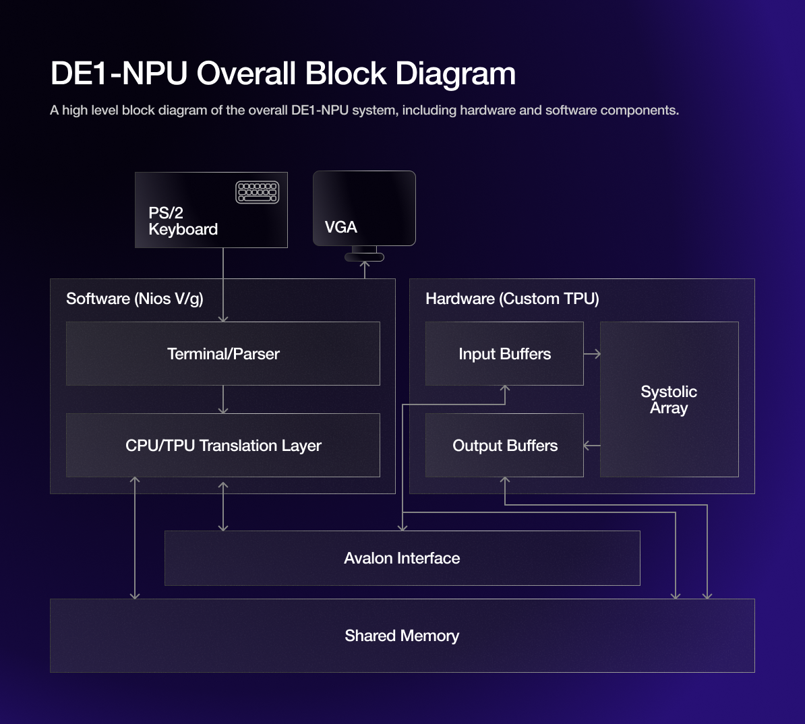
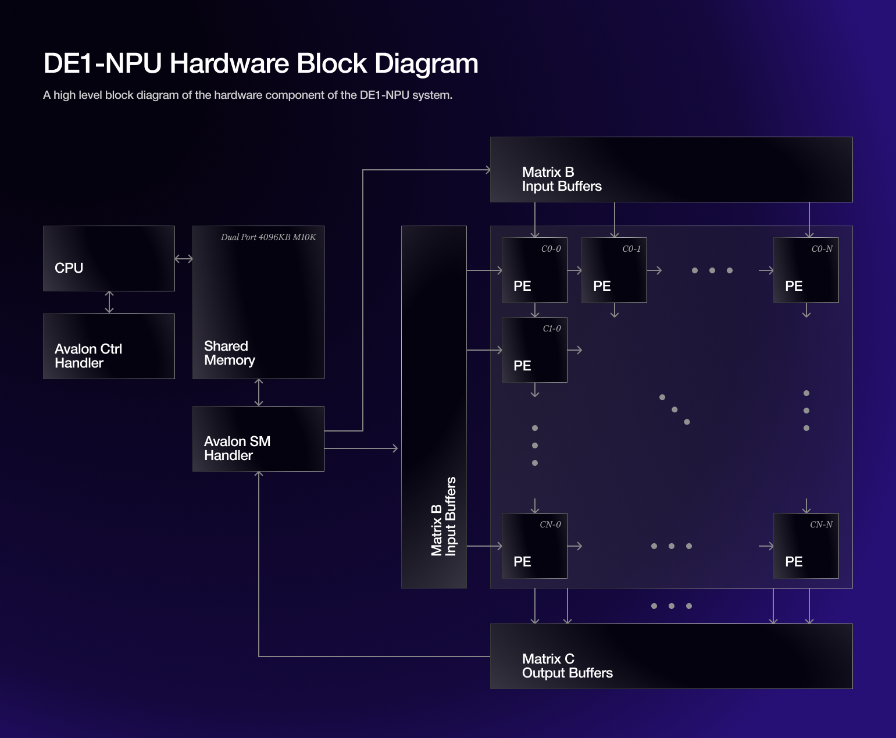
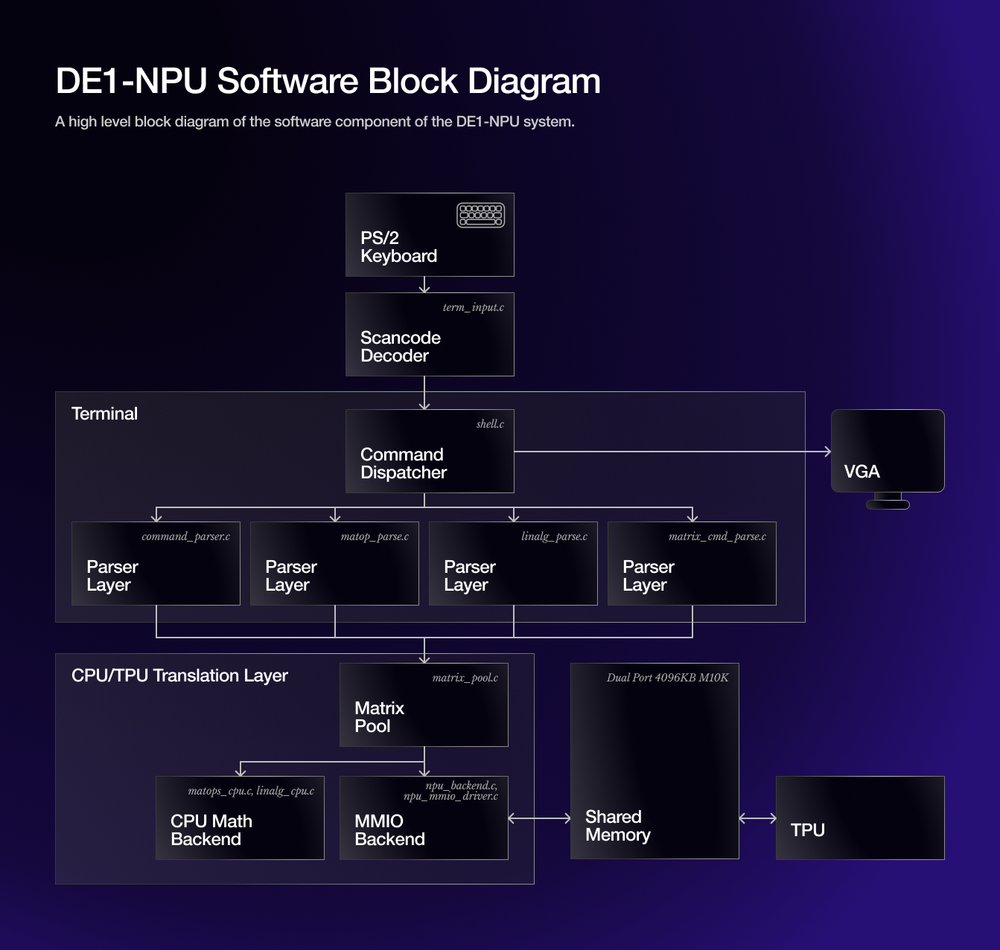

##  What is DE1-NPU?
DE1-NPU is a hardware **Tensor Processing Unit (TPU)** that accelerates matrix multiplication, and a **software wrapper** for the TPU that enables a terminal on VGA for IO, as well as other vector and matrix operations that can take advantage of the accelerator. This system shows the systolic array AI accelerator functioning at its core, without abstracting it behind a practical AI demonstration; it directly shows the matrix multiplications, along with other matrix operations. It's built to run on the [DE1-SoC](https://www.terasic.com.tw/cgi-bin/page/archive.pl?Language=English&No=836) FPGA board; however, it could be ported to other Altera SoC boards, assuming the CPU is rebuilt if needed. For the DE1-SoC, this is done using the scripts available [here](https://github.com/fpgacademy/Design_Examples/tree/main/Computer_Systems).

The hardware component of this project was based on a much smaller, TinyTapeout-synthesizable TPU design, which you can view [here](https://github.com/HynixCJR/ttsky-miniTPU). The original TPU was made by [Matthew Kong](https://github.com/HynixCJR), [Albert Huang](https://github.com/dphhs), [Jiya Nair](https://github.com/Jiya-uoft), and [Rivera Wijaya](https://github.com/RiveraWijaya). This project was made by [Matthew Kong](https://github.com/HynixCJR) and [Parth Talati](https://github.com/parthT123-E) for ECE243 at the University of Toronto.

---
## Table of Contents
For better or for worse, this document is quite long, so I've added a Table of Contents to help you navigate.
1. [High Level Block Diagram](#high-level-block-diagram)
2. [Hardware](https://github.com/HynixCJR/DE1-NPU/#hardware-the-tensor-processing-unit)

    2.1 [Tensor Processing Unit](#hardware-the-tensor-processing-unit)
   
    2.2 [Shared Memory](#2-shared-memory)
   
    2.3 [Avalon MM Interface](#3-avalon-mm-interface)
   
    - 2.3.1 [TPU Base Control Register](#31-tpu-base-control-register)
    - 2.3.2 [TPU Matrix A Pointer Register](#32-tpu-matrix-a-pointer-register)
    - 2.3.3 [TPU Matrix B Pointer Register](#33-tpu-matrix-b-pointer-register)
    - 2.3.4 [TPU Matrix C Pointer Register](#34-tpu-matrix-c-pointer-register)
    
    2.4 [Nios V/g Processor](#4-modified-nios-vg-processor)
4. [Software](#software-the-terminal-wrapper)

---

### High Level Block Diagram

### Hardware: The Tensor Processing Unit
_Tools/HDL used: SystemVerilog, Quartus Prime (Platform Designer), Altera Avalon_

The hardware component of the NPU consists of:
1. The Tensor Processing Unit
2. Shared memory, accessible by both CPU and TPU
3. Avalon MM interface
4. A modified Nios V/g processor with all Verilog components built in

#### 1. Tensor Processing Unit
The TPU component consists of a **16x16 INT8 systolic array**, which pulses a data load every two clock cycles (alternatively, when shared memory read data has returned, if two cycles is not enough -- however, because the shared memory is on-chip memory, it is two cycles in practice). Upon data load, it performs a single calculation cycle, which performs a Multiply-Accumulate (MAC) for each of the 256 Processing Elements (PEs). This continues until individual PEs register that they are completed, after which their outputs are stored in a buffer. After all outputs are stored into the buffer, they are written to shared memory at a pre-defined address, and a DONE signal is sent through the Avalon interface (i.e., MMIO) to inform the software component that calculations are complete.

All outputs go through an activation function module, which applies an activation function (if selected by the software and indicated in the MMIO instruction). This allows nonlinear outputs from the NPU. Additionally, square matrices smaller than 16x16 in orders of 2 (i.e., 2x2, 4x4, 8x8) can be efficiently multiplied by selecting the size of the matrices in the MMIO instruction -- this enables or disables different PEs and alters the FSM function.

#### 2. Shared Memory
The Shared Memory is a 4KB, dual port M10K memory block created through Platform Designer. This memory stores the actual matrix data, both as inputs (to the TPU) and outputs (to the software wrapper); matrix data is stored in addresses specified in the MMIO instructions. One of the ports is connected to the hardware TPU, and the other is connected to the software wrapper. Because each port is separate, the TPU can utilize a wider bus width (128 bits) to achieve higher transfer rates, while the CPU can remain at its standard 32 bit bus width (Nios-V/g is a 32-bit architecture). Because it is a pure M10K memory block configuration, it has much lower latency than the DDR3 DRAM that is included on the DE1-SoC; it achieves single-digit cycle latencies, whereas DRAM would have 300+ cycle latencies. This allows the TPU to more rapidly access data, thus improving performance.

Matrices must be written to this memory by CPU as flattened arrays. Matrix A must be written in column-major order, and Matrices B and C must be written in row-major order. Matrix A and B values must be staggered. Blank values (i.e., data loaded in that's not assigned to any actual value) should be 8-bit zero. Matrix C does not need to be staggered.

#### 3. Avalon MM Interface
The Avalon Memory Mapped (MM) interface is used to coordinate "slow" communication between the TPU and the software. The MMIO control register structure is shown below.

##### 3.1 TPU Base Control Register
Base control register for the TPU MMIO.

| Register Name | Base Addresses | Bits 31...6 | Bits 5-4 | Bits 3-2 | Bit 1    | Bit 0     |
|---------------|----------------|-------------|----------|----------|----------|-----------|
| Ctrl (Base)   | `0x0901_1000`    | *Unused*    | `act`      | `size`     | `reg_done` | `reg_start` |

- `reg_start`: Bit 0, written by CPU, read-only on TPU side. Enable signal for TPU. CPU sets to 1 to start a matrix computation; makes TPU read from memory at addresses specified by Matrix A and Matrix B pointer registers. 0 if TPU is not active.
- `reg_done`: Bit 1, read-only on CPU side, written by TPU. TPU sets this to 1 when computations are complete and ready to be read from shared memory.
- `size`: Bits 3-2, written by CPU, read-only by TPU. Toggles the size of the matrix multiplication.
00 => 2x2, 01 => 4x4, 10 => 8x8, 11 => 16x16. Inputted matrices MUST abide by these sizes for TPU to read/write correctly.
- `act`: Bits 5-4, written by CPU, read-only by TPU. Toggles the activation function used by the TPU.
00 => None (linear), 01 => ReLU, 10 => Leaky ReLU (a=0.125), 11 => ReLU6.

##### 3.2 TPU Matrix A Pointer Register
TPU register that stores address of input matrix A in shared memory.

| Register Name    | Base Addresses | Bits 31...0 |
|------------------|----------------|-------------|
| Matrix A Pointer | `0x0901_1004`  | `matA_ptr`  |

- `matA_ptr`: Bits 31-0, 32-bit pointer to location in shared memory where Matrix A for matrix multiplication computation is stored. Read-only by TPU.

##### 3.3 TPU Matrix B Pointer Register
TPU register that stores address of input matrix B in shared memory.

| Register Name    | Base Addresses | Bits 31...0 |
|------------------|----------------|-------------|
| Matrix B Pointer | `0x0901_1008`  | `matB_ptr`  |

- `matB_ptr`: Bits 31-0, 32-bit pointer to location in shared memory where Matrix B for matrix multiplication computation is stored. Read-only by TPU.

##### 3.4 TPU Matrix C Pointer Register
TPU register that stores address of output matrix C in shared memory.

| Register Name    | Base Addresses | Bits 31...0 |
|------------------|----------------|-------------|
| Matrix C Pointer | `0x0901_100c`  | `matC_ptr`  |

- `matC_ptr`: Bits 31-0, 32-bit pointer to location in shared memory where Matrix C for matrix multiplication computation is stored. Read-only by CPU; TPU writes final output values to this location in the shared memory. All previously-written values in this location in memory will be overwritten by the TPU.

#### 4. Modified Nios V/g processor
The Nios V/g processor that the software runs on was modified in Platform Designer to add all other hardware components. It is built using scripts provided [here](https://github.com/fpgacademy/Design_Examples/tree/main/Computer_Systems). Additional MMIO is not removed in the `.sof` file in this repository, but can feasibly be removed, so long as all dependencies in those scripts are updated; audio, for example, can be removed for slightly faster CPU compile times, as it is not used in the DE1-NPU system.

---

### Software: The Terminal Wrapper
To coordinate hardware matrix data loading, keyboard input, VGA output, terminal graphics, additional matrix operations (determinant, plotting, etc.), and software matrix multiplication.

*this section is currently incomplete*
